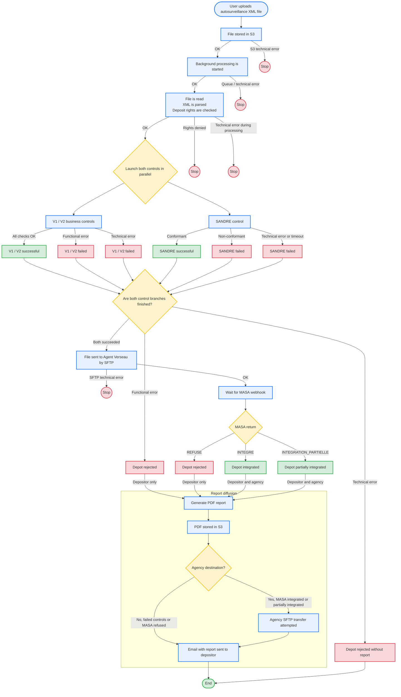

```mermaid
flowchart TD
    A([User uploads autosurveillance XML file]) --> B[File stored in S3]
    B -->|OK| C[Background processing is started]
    B -->|S3 technical error| STOP1((Stop))
    C -->|OK| D[File is read<br/>XML is parsed<br/>Deposit rights are checked]
    C -->|Queue / technical error| STOP2((Stop))
    D -->|OK| E{Launch both controls in parallel}
    D -->|Rights denied| STOP3((Stop))
    D -->|Technical error during processing| STOP4((Stop))
    E --> F[V1 / V2 business controls]
    E --> G[SANDRE control]
    F -->|All checks OK| FOK[V1 / V2 successful]
    F -->|Functional error| FKO[V1 / V2 failed]
    F -->|Technical error| FTECH[V1 / V2 failed]
    G -->|Conformant| GOK[SANDRE successful]
    G -->|Non-conformant| GKO[SANDRE failed]
    G -->|Technical error or timeout| GTECH[SANDRE failed]
    FOK --> H{Are both control branches finished?}
    FKO --> H
    FTECH --> H
    GOK --> H
    GKO --> H
    GTECH --> H
    H -->|Functional error| R1[Depot rejected]
    H -->|Technical error| RTECH[Depot rejected without report]
    H -->|Both succeeded| I[File sent to Agent Verseau by SFTP]
    I -->|SFTP technical error| STOP5((Stop))
    I -->|OK| N[Wait for MASA webhook]
    N --> O{MASA return}
    O -->|REFUSE| O1[Depot rejected]
    O -->|INTEGRE| O2[Depot integrated]
    O -->|INTEGRATION_PARTIELLE| O3[Depot partially integrated]
    subgraph RD["Report diffusion"]
        direction TB
        P1[Generate PDF report]
        P2[PDF stored in S3]
        PDEST{Agency destination?}
        P3[Agency SFTP transfer attempted]
        P4[Email with report sent to depositor]
        P1 --> P2
        P2 --> PDEST
        PDEST -->|Yes, MASA integrated or partially integrated| P3
        PDEST -->|No, failed controls or MASA refused| P4
        P3 --> P4
    end
    R1 -->|Depositor only| P1
    O1 -->|Depositor only| P1
    O2 -->|Depositor and agency| P1
    O3 -->|Depositor and agency| P1
    P4 --> END([End])
    RTECH --> END
    classDef success fill:#d4edda,stroke:#28a745,stroke-width:2px;
    classDef error fill:#f8d7da,stroke:#dc3545,stroke-width:2px;
    classDef process fill:#e7f1ff,stroke:#0d6efd,stroke-width:2px;
    classDef decision fill:#fff3cd,stroke:#ffc107,stroke-width:2px;
    classDef terminal fill:#f8d7da,stroke:#dc3545,stroke-width:2px;
    class A,B,C,D,E,F,G,H,I,N,O,P1,P2,P3,P4 process;
    class FKO,FTECH,GKO,GTECH,R1,RTECH,O1 error;
    class FOK,GOK,O2,O3,END success;
    class E,H,O,PDEST decision;
    class STOP1,STOP2,STOP3,STOP4,STOP5 terminal;
```
