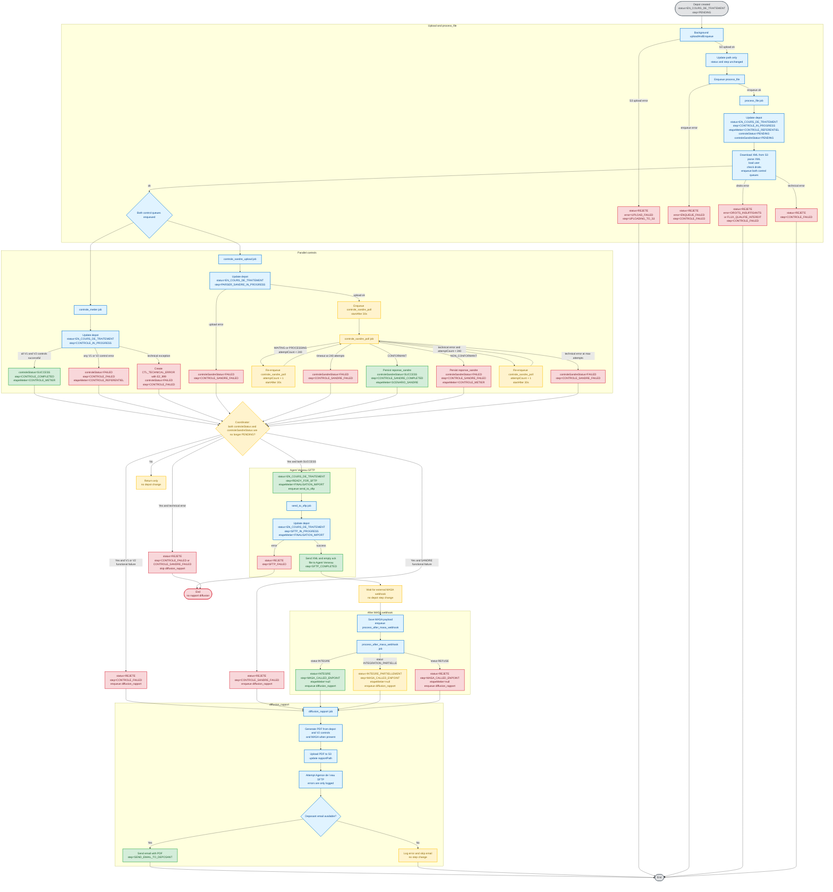

```mermaid
flowchart TD
    %% Color definitions
    classDef success fill:#d4edda,stroke:#28a745,stroke-width:2px,color:#155724;
    classDef error fill:#f8d7da,stroke:#dc3545,stroke-width:2px,color:#721c24;
    classDef warning fill:#fff3cd,stroke:#ffc107,stroke-width:2px,color:#856404;
    classDef info fill:#e0f3ff,stroke:#0275d8,stroke-width:2px,color:#004085;
    classDef init fill:#e2e3e5,stroke:#6c757d,stroke-width:2px,color:#383d41;
    A([Depot created<br/>status=EN_COURS_DE_TRAITEMENT<br/>step=PENDING]) --> B[Background uploadAndEnqueue]
    subgraph U["Upload and process_file"]
      B -->|S3 upload ok| C[Update path only<br/>status and step unchanged]
      B -->|S3 upload error| BERR[status=REJETE<br/>error=UPLOAD_FAILED<br/>step=UPLOADING_TO_S3]
      C --> D[Enqueue process_file]
      D -->|enqueue ok| E[process_file job]
      D -->|enqueue error| DERR[status=REJETE<br/>error=ENQUEUE_FAILED<br/>step=CONTROLE_FAILED]
      E --> E0[Update depot<br/>status=EN_COURS_DE_TRAITEMENT<br/>step=CONTROLE_IN_PROGRESS<br/>etapeMetier=CONTROLE_REFERENTIEL<br/>controleStatus=PENDING<br/>controleSandreStatus=PENDING]
      E0 --> E1[Download XML from S3<br/>parse XML<br/>load user<br/>check droits<br/>enqueue both control queues]
      E1 -->|droits error| ERIGHTS[status=REJETE<br/>error=DROITS_INSUFFISANTS or FLUX_QUALIFIE_INTERDIT<br/>step=CONTROLE_FAILED]
      E1 -->|technical error| ETECH[status=REJETE<br/>step=CONTROLE_FAILED]
      E1 -->|ok| SPLIT{Both control queues enqueued}
    end
    subgraph C1["Parallel controls"]
      SPLIT --> M0[controle_metier job]
      SPLIT --> S0[controle_sandre_upload job]
      M0 --> M1[Update depot<br/>status=EN_COURS_DE_TRAITEMENT<br/>step=CONTROLE_IN_PROGRESS]
      M1 -->|all V1 and V2 controls successful| MOK[controleStatus=SUCCESS<br/>step=CONTROLE_COMPLETED<br/>etapeMetier=CONTROLE_METIER]
      M1 -->|any V1 or V2 control error| MFAIL[controleStatus=FAILED<br/>step=CONTROLE_FAILED<br/>etapeMetier=CONTROLE_REFERENTIEL]
      M1 -->|technical exception| MTECH[Create CTL_TECHNICAL_ERROR with E2_999<br/>controleStatus=FAILED<br/>step=CONTROLE_FAILED]
      S0 --> S1[Update depot<br/>status=EN_COURS_DE_TRAITEMENT<br/>step=PARSER_SANDRE_IN_PROGRESS]
      S1 -->|upload error| SUPLOADFAIL[controleSandreStatus=FAILED<br/>step=CONTROLE_SANDRE_FAILED]
      S1 -->|upload ok| SPOLLQ[Enqueue controle_sandre_poll<br/>startAfter 30s]
      SPOLLQ --> SPOLL[controle_sandre_poll job]
      SPOLL -->|WAITING or PROCESSING<br/>attemptCount < 240| SPOLLRETRY[Re-enqueue controle_sandre_poll<br/>attemptCount + 1<br/>startAfter 30s]
      SPOLLRETRY --> SPOLL
      SPOLL -->|timeout at 240 attempts| STIMEOUT[controleSandreStatus=FAILED<br/>step=CONTROLE_SANDRE_FAILED]
      SPOLL -->|CONFORMANT| SOK[Persist reponse_sandre<br/>controleSandreStatus=SUCCESS<br/>step=CONTROLE_SANDRE_COMPLETED<br/>etapeMetier=SCENARIO_SANDRE]
      SPOLL -->|NON_CONFORMANT| SFAIL[Persist reponse_sandre<br/>controleSandreStatus=FAILED<br/>step=CONTROLE_SANDRE_FAILED<br/>etapeMetier=CONTROLE_METIER]
      SPOLL -->|technical error and attemptCount < 240| SPOLLERRRETRY[Re-enqueue controle_sandre_poll<br/>attemptCount + 1<br/>startAfter 30s]
      SPOLLERRRETRY --> SPOLL
      SPOLL -->|technical error at max attempts| STECHFAIL[controleSandreStatus=FAILED<br/>step=CONTROLE_SANDRE_FAILED]
    end
    MOK --> COORD
    MFAIL --> COORD
    MTECH --> COORD
    SUPLOADFAIL --> COORD
    STIMEOUT --> COORD
    SOK --> COORD
    SFAIL --> COORD
    STECHFAIL --> COORD
    COORD{Coordinator:<br/>both controleStatus and controleSandreStatus are no longer PENDING?}
    COORD -->|No| WAIT[Return only<br/>no depot change]
    COORD -->|Yes and both SUCCESS| READY[status=EN_COURS_DE_TRAITEMENT<br/>step=READY_FOR_SFTP<br/>etapeMetier=FINALISATION_IMPORT<br/>enqueue send_to_sftp]
    COORD -->|Yes and V1 or V2 functional failure| REJMETIER[status=REJETE<br/>step=CONTROLE_FAILED<br/>enqueue diffusion_rapport]
    COORD -->|Yes and SANDRE functional failure| REJSANDRE[status=REJETE<br/>step=CONTROLE_SANDRE_FAILED<br/>enqueue diffusion_rapport]
    COORD -->|Yes and technical error| REJTECH[status=REJETE<br/>step=CONTROLE_FAILED or CONTROLE_SANDRE_FAILED<br/>skip diffusion_rapport]
    subgraph SFTP["Agent Verseau SFTP"]
      READY --> FTP0[send_to_sftp job]
      FTP0 --> FTP1[Update depot<br/>status=EN_COURS_DE_TRAITEMENT<br/>step=SFTP_IN_PROGRESS<br/>etapeMetier=FINALISATION_IMPORT]
      FTP1 -->|success| FTP2[Send XML and empty ack file to Agent Verseau<br/>step=SFTP_COMPLETED]
      FTP1 -->|error| FTPERR[status=REJETE<br/>step=SFTP_FAILED]
    end
    FTP2 --> MASAWAIT[Wait for external MASA webhook<br/>no depot step change]
    FTPERR --> ENDNOREPORT([End<br/>no rapport diffusion])
    MASAWAIT --> WEBHOOK[Save MASA payload<br/>enqueue process_after_masa_webhook]
    subgraph M2["After MASA webhook"]
      WEBHOOK --> MASA0[process_after_masa_webhook job]
      MASA0 -->|statut INTEGRE| MASAOK[status=INTEGRE<br/>step=MASA_CALLED_ENPOINT<br/>etapeMetier=null<br/>enqueue diffusion_rapport]
      MASA0 -->|statut INTEGRATION_PARTIELLE| MASAPART[status=INTEGRE_PARTIELLEMENT<br/>step=MASA_CALLED_ENPOINT<br/>etapeMetier=null<br/>enqueue diffusion_rapport]
      MASA0 -->|statut REFUSE| MASAREF[status=REJETE<br/>step=MASA_CALLED_ENPOINT<br/>etapeMetier=null<br/>enqueue diffusion_rapport]
    end
    REJMETIER --> RAP0
    REJSANDRE --> RAP0
    MASAOK --> RAP0
    MASAPART --> RAP0
    MASAREF --> RAP0
    REJTECH --> ENDNOREPORT
    subgraph R["diffusion_rapport"]
      RAP0[diffusion_rapport job] --> RAP1[Generate PDF from depot and V2 controls<br/>and MASA when present]
      RAP1 --> RAP2[Upload PDF to S3<br/>update rapportPath]
      RAP2 --> RAP3[Attempt Agence de l eau SFTP<br/>errors are only logged]
      RAP3 --> RAP4{Deposant email available?}
      RAP4 -->|Yes| RAP5[Send email with PDF<br/>step=SEND_EMAIL_TO_DEPOSANT]
      RAP4 -->|No| RAP6[Log error and skip email<br/>no step change]
    end
    RAP5 --> END([End])
    RAP6 --> END
    BERR --> END
    DERR --> END
    ERIGHTS --> END
    ETECH --> END
    %% Apply Classes
    class A,END init;
    class BERR,DERR,ERIGHTS,ETECH,MFAIL,MTECH,SUPLOADFAIL,STIMEOUT,SFAIL,STECHFAIL,REJMETIER,REJSANDRE,REJTECH,FTPERR,MASAREF,ENDNOREPORT error;
    class MOK,SOK,READY,FTP2,MASAOK,RAP5 success;
    class SPOLLQ,SPOLL,SPOLLRETRY,SPOLLERRRETRY,WAIT,MASAWAIT,MASAPART,COORD,RAP6 warning;
    class B,C,D,E,E0,E1,SPLIT,M0,S0,M1,S1,FTP0,FTP1,WEBHOOK,MASA0,RAP0,RAP1,RAP2,RAP3,RAP4 info;
```